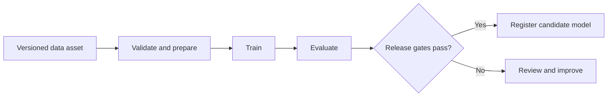

# Training Pipelines

Last updated: 2026-07-27

Azure Machine Learning pipelines turn a successful experiment into a repeatable,
parameterized training process. Define each major step as a reusable component
with typed inputs, outputs, and configuration.

## Pipeline design

| Step | Purpose |
| --- | --- |
| Validate and prepare | Check contracts, transform data, and produce versioned features. |
| Train | Run a parameterized job on the selected compute target. |
| Evaluate | Compare the candidate with baseline and champion model criteria. |
| Register | Create a model version only after quality and governance gates pass. |

## Compute and cost controls

- Use Azure Machine Learning compute clusters with a minimum node count of zero
  for workloads that do not need always-on capacity.
- Select central processing unit (CPU) compute for classical machine learning and
  graphics processing unit (GPU) compute only when the framework and workload
  justify it.
- Use low-priority or spot capacity for interruption-tolerant training with
  checkpointing.
- Pin Azure Machine Learning environments so local development, continuous
  integration, and cloud training use compatible dependencies.

!!! note
    Pipeline output reuse can make iterative development faster, but a change in
    data, parameters, code, or environment should intentionally invalidate the
    affected output.

Reference: [Azure Machine Learning pipelines](https://learn.microsoft.com/azure/machine-learning/concept-ml-pipelines).